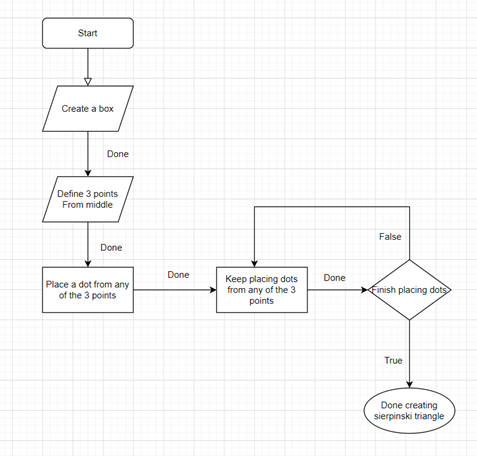

# SierpinskiTrekant
 
Lige nu er koden igang med at køre, men den stomper på det største problem, der er ingen måder mine punkter virker siden jeg laver en If statement, men den skal jeg arbejde videre med.

Iforhold til min algoritme, er det ikke noget der er opdateret, men den gamle algoritme er planen indtil videre.

Algoritme: For at definerer vores 3 punkter som vores input, skal vi finde ud af hvad vores output skal være. Efter vi har fundet vores input startpunkt som ville være starte programmet og den har lavet en boks, skal vi definerer 3 punkter som ville lave en trekant, det lige meget hvor lige siderne er, så længe den kan blive kaldt en trekant. Efter trekanten er dannet, starter programmet med at finde et punkt fra et hjørne hvor den så putter en nyt punkt der. Lige efter den prik er dannet så går vi tilbage til punkt 3 indtil vores trekant er færdig.

Det her var hvordan det skulle se ud, men istedet for det kunne jeg ikke få det til at lave punkter, så det endte med at jeg skulle gå en anden vej.

Så blev det til at være sådan her

Det var meningen jeg skulle lave en kode, men originalt så havde jeg ikke tid til det. Så bruger jeg den her kode istedet for, den her [Kode](https://runestone.academy/runestone/books/published/pythonds/Recursion/pythondsSierpinskiTriangle.html)
er en bevis på hvordan den rigtig kunne se ud i 2D, men fordi at det her var en 3D projekt, går den en anden retning

Den her kode har lavet det hele i en simpel del hvor den giver farve pr. trekant, så laver den en hel ny skærm og den laver kun en grænsende trækant. 
Det er bevis på hvordan det burde se ud, hvor den så laver trækant en efter en, men koden er ikke min så det ville være nemlig forskelligt hvis jeg lavede den i 3D tegning.

Koden virker på den måde at, den starter med at lave en Def for tegningen af trekanten, hvor den giver den farver og punkter def drawTriangle(points,color,myTurtle):

Der efter har vi en def getMid, hvor den bruger denne kode til at lave math med, hvor den regner ud hvor mange punkter hver trekant skal have

Fra den går vi til def sierpinski(points,degree,myTurtle):, det vores definition til igen, farver og grader som trekanterne skal have, små indre trekanter røde, små trekanter blå, store trekanter grønne og midten hvid

Så har vi vores def main():, som er vores main fil som kører hele programmet, den laver både skærmen og den laver også koordinaterne på sierpinski trekanten